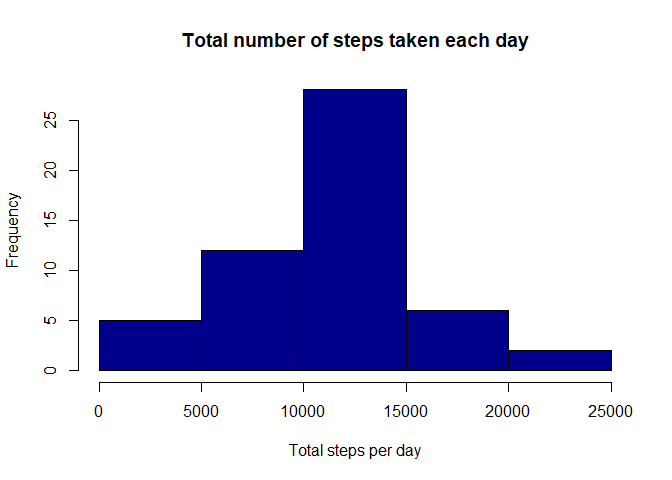

    library(dplyr)
    library(knitr)
    library(ggplot2)

1. Read activity data
---------------------

    # Read activity data
    activity_data <- read.csv("~/activity.csv", stringsAsFactors = F, header = T)

    # Assign date class to date column
    activity_data$date <- as.Date(activity_data$date)

1. Explore data
---------------

    # Check dimensions
    dim(activity_data)

    ## [1] 17568     3

    summary(activity_data)

    ##      steps             date               interval     
    ##  Min.   :  0.00   Min.   :2012-10-01   Min.   :   0.0  
    ##  1st Qu.:  0.00   1st Qu.:2012-10-16   1st Qu.: 588.8  
    ##  Median :  0.00   Median :2012-10-31   Median :1177.5  
    ##  Mean   : 37.38   Mean   :2012-10-31   Mean   :1177.5  
    ##  3rd Qu.: 12.00   3rd Qu.:2012-11-15   3rd Qu.:1766.2  
    ##  Max.   :806.00   Max.   :2012-11-30   Max.   :2355.0  
    ##  NA's   :2304

    knitr::kable(activity_data[1:10,])

<table>
<thead>
<tr class="header">
<th style="text-align: right;">steps</th>
<th style="text-align: left;">date</th>
<th style="text-align: right;">interval</th>
</tr>
</thead>
<tbody>
<tr class="odd">
<td style="text-align: right;">NA</td>
<td style="text-align: left;">2012-10-01</td>
<td style="text-align: right;">0</td>
</tr>
<tr class="even">
<td style="text-align: right;">NA</td>
<td style="text-align: left;">2012-10-01</td>
<td style="text-align: right;">5</td>
</tr>
<tr class="odd">
<td style="text-align: right;">NA</td>
<td style="text-align: left;">2012-10-01</td>
<td style="text-align: right;">10</td>
</tr>
<tr class="even">
<td style="text-align: right;">NA</td>
<td style="text-align: left;">2012-10-01</td>
<td style="text-align: right;">15</td>
</tr>
<tr class="odd">
<td style="text-align: right;">NA</td>
<td style="text-align: left;">2012-10-01</td>
<td style="text-align: right;">20</td>
</tr>
<tr class="even">
<td style="text-align: right;">NA</td>
<td style="text-align: left;">2012-10-01</td>
<td style="text-align: right;">25</td>
</tr>
<tr class="odd">
<td style="text-align: right;">NA</td>
<td style="text-align: left;">2012-10-01</td>
<td style="text-align: right;">30</td>
</tr>
<tr class="even">
<td style="text-align: right;">NA</td>
<td style="text-align: left;">2012-10-01</td>
<td style="text-align: right;">35</td>
</tr>
<tr class="odd">
<td style="text-align: right;">NA</td>
<td style="text-align: left;">2012-10-01</td>
<td style="text-align: right;">40</td>
</tr>
<tr class="even">
<td style="text-align: right;">NA</td>
<td style="text-align: left;">2012-10-01</td>
<td style="text-align: right;">45</td>
</tr>
</tbody>
</table>

2. Histogram of the total number of steps taken each day
--------------------------------------------------------

    # Remove rows with missing data
    activity_data_noNA <- na.omit(activity_data)

    activity_data_noNA$steps <-  as.numeric(activity_data_noNA$steps)

    # Group data by date and find total steps per day.
    activity_sum_steps <- 
      activity_data_noNA %>%
      group_by(date) %>%
      summarize(total_steps = sum(steps, na.rm = T))

    # plot histogram
    hist(activity_sum_steps$total_steps, main="Total number of steps taken each day", 
         xlab="Total steps per day", col = 'dark blue')

3. Mean and median number of steps taken each day
-------------------------------------------------

    median(activity_sum_steps$total_steps)

    ## [1] 10765

    mean(activity_sum_steps$total_steps)

    ## [1] 10766.19

4. Time series plot of the average number of steps taken
--------------------------------------------------------

    # Group data by interval and find average steps per day.
    activity_mean_steps <- 
      activity_data_noNA %>%
      group_by(interval) %>%
      summarize(total_steps = mean(steps, na.rm = TRUE))

    # Plot time series plot of the average number of steps taken
    ggplot(aes(x=interval,y=total_steps),data=activity_mean_steps)+geom_line(color = "orange", size = 1.0) +
       ggtitle("The average number of steps by interval") 

5. The 5-minute interval that, on average, contains the maximum number of steps
-------------------------------------------------------------------------------

    # Find maximum average 5 min interval
    activity_mean_steps[activity_mean_steps$total_steps == max(activity_mean_steps$total_steps),1]

    ## # A tibble: 1 x 1
    ##   interval
    ##      <int>
    ## 1      835

6. Code to describe and show a strategy for imputing missing data
-----------------------------------------------------------------

    # Check missing values in all the three columns (as there are only three columns)
    sum(is.na(activity_data$steps))

    ## [1] 2304

    sum(is.na(activity_data$date))

    ## [1] 0

    sum(is.na(activity_data$interval))

    ## [1] 0

    # Data is missing in 2304 rows in steps column

    # Fill missing rows with column mean value
    activity_data$steps[is.na(activity_data$steps)] <- mean(activity_data$steps,na.rm=TRUE)

7. Histogram of the total number of steps taken each day after missing values are imputed
-----------------------------------------------------------------------------------------

    # Find total number of steps taken per day after imputing
    activity_sum_steps_imputed <- 
      activity_data %>%
      group_by(date) %>%
      summarize(total_steps = sum(steps, na.rm = T))

    # Plot histogram
    hist(activity_sum_steps_imputed$total_steps, main="Total number of steps taken each day (post imputing)", 
         xlab="Total steps per day", col = 'dark green')

8. Panel plot comparing the average number of steps taken per 5-minute interval across weekdays and weekends
------------------------------------------------------------------------------------------------------------

    # Map day name for date
    activity_data$days=tolower(weekdays(activity_data$date))

    # head(activity_data)
    # unique(activity_data$days)

    # Assign days to weekend or weekday
    activity_data$category <- ifelse(grepl("saturday|sunday", activity_data$days),"weekend","weekday")

    # Find average number of steps on weekend or weekday in the intervals
    activity_mean_steps_days <- 
      activity_data %>%
      group_by(interval, category) %>%
      summarize(mean_steps = mean(steps, na.rm = T))

    # Plot average steps and interval as per day category

    ggplot(aes(x=interval,y=mean_steps),data=activity_mean_steps_days)+geom_line(color = "dark blue", size = 1.0)+facet_wrap(~activity_mean_steps_days$category)

